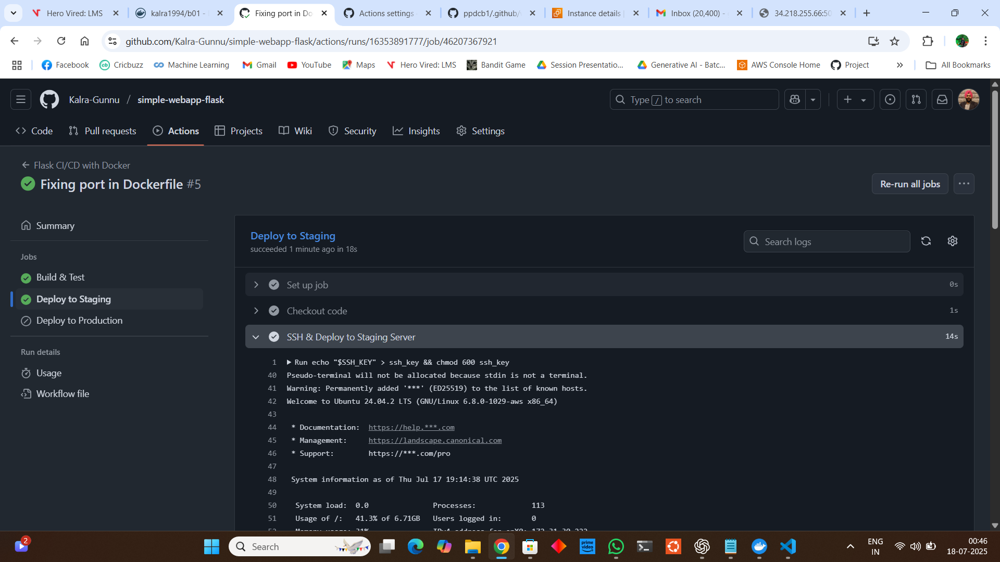

# Flask CI/CD Pipeline with GitHub Actions & AWS EC2  

This project demonstrates a **CI/CD pipeline** for a simple Flask application using **GitHub Actions** and deploying to **AWS EC2 instances** (Staging & Production).  

---

## 🚀 Workflow Overview  

- **GitHub Actions** automates build, test, and deployment.  
- **Two EC2 instances**:  
  - `Staging` → triggered on `staging` branch pushes  
  - `Production` → triggered on GitHub Release (`master` branch)  
- **Docker** used for containerized deployment.  
- **GitHub Secrets** securely store SSH keys and server details.  

---

## ✅ Step-by-Step Setup  

### 1️⃣ Fork the Repository  
- **Fork the repo** to your GitHub account  
- Repo forked successfully  

  
  

---

### 2️⃣ Create a Staging Branch  
- Created a new branch `staging` (default branch is `master`)  

  
  

---

### 3️⃣ Add Basic Tests  
- Created `tests/test_app.py` for simple Flask route testing  

  
  

---

### 4️⃣ Create GitHub Actions Workflow  
- Added `.github/workflows/ci-cd.yml` for build, test, and deployment pipeline  

  
  

---

### 5️⃣ Disable Actions Temporarily  
- Disabled GitHub Actions initially to avoid failures before configuring secrets  

---

### 6️⃣ Launch AWS EC2 Instances  
- **2 Ubuntu EC2 instances**:  
  - One for **Staging**  
  - One for **Production**  

  

---

### 7️⃣ Configure GitHub Secrets  
Go to **Repo Settings → Secrets & Variables → Actions → New Repository Secret** and add:  
- `SSH_KEY` → EC2 private key  
- `STAGING_HOST`, `STAGING_USER`  
- `PROD_HOST`, `PROD_USER`  

  

---

### 8️⃣ Clone Repo Locally & Switch Branch  
- Cloned repo locally  
- Checked out `staging` branch  
- Opened in VS Code  

  
  

---

### 9️⃣ Update Application for Environment Awareness  
- Modified `app.py` to return **environment-specific messages**  

  

---

### 🔟 Update Dockerfile  
- Added `ENV APP_ENV` support  

  

---

### 1️⃣1️⃣ Update CI/CD Workflow  
- Updated `ci-cd.yml` to pass `-e APP_ENV` in `docker run`  

  

---

### 1️⃣2️⃣ Push Changes to Staging  
- Added files, committed, and pushed to `staging` branch  
- Triggered GitHub Actions Workflow  

  
  

---

### 1️⃣3️⃣ First Workflow Run  
- **Build & Test** passed  
- **Deployment failed** → missing `sudo` for Docker commands  

  

---

### 1️⃣4️⃣ Fix Deployment Issue  
- Updated YAML to use `sudo` with Docker  
- Committed changes → triggered another workflow  

  

---

### 1️⃣5️⃣ Successful Staging Deployment  
- Flask app deployed successfully to staging server  
- Accessible at:  
  ```
  http://<STAGING_INSTANCE_IP>:5000/how%20are%20you
  ```
  ✅ Shows: **Hello from Staging environment!**

  
  
  

---

### 1️⃣6️⃣ Deploy Production  

1. Go to **GitHub → Releases → Draft a new release**  
2. Select **target branch:** `master`  
3. Enter **tag:** `v1.0.0`  
4. Title: `Production Release v1.0.0`  
5. Click **Publish Release**  

  

- Workflow triggered **deploy-production** job  
- Initially failed due to wrong branch name (`main` instead of `master`)  
- Fixed YAML and created a **new release**  

✅ **Production Deployment Successful**

  
  

---

### 1️⃣7️⃣ Verify Production  

Visit:  
```
http://<PRODUCTION_INSTANCE_IP>:5000/how%20are%20you
```

✅ Shows: **Hello from Production environment!**  

  

---

## 🔑 Secrets Required  

| Secret Name     | Description |
|-----------------|-------------|
| `SSH_KEY`       | Private SSH key for EC2 |
| `STAGING_HOST`  | Staging EC2 Public IP |
| `STAGING_USER`  | SSH User for Staging EC2 |
| `PROD_HOST`     | Production EC2 Public IP |
| `PROD_USER`     | SSH User for Production EC2 |

---

## 🏗 Pipeline Trigger Rules  

- **Push to `staging` branch** → Deploys to Staging Server  
- **GitHub Release on `master` branch** → Deploys to Production Server  

---

## ✅ Final Status  

- Staging URL: ✅ Working  
- Production URL: ✅ Working  
- CI/CD Workflow: ✅ Automated & Tested  

---

### 📜 Summary  

This CI/CD setup provides:  
✔ Automated build & test on each push  
✔ Seamless deployment to Staging & Production  
✔ Environment-specific Dockerized Flask app  

---

**Author:** *Your Name*  
**Repo:** [simple-webapp-flask](#)
